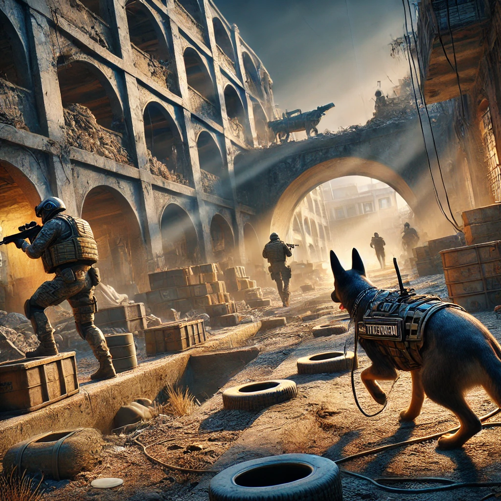

# BiteQuest
Tagline: כלב עוקץ – משימה מצילת חיים!
---
## מהות המשחק
BiteQuest מציב אותך בנעלי כלב עוקץ במלחמת "חרבות ברזל". עליך לסרוק מבנים, לזהות איומים כמו מלכודים, מחבלים ופירי מנהרות, ולהתריע לחייל כדי למנוע אסונות. המשחק משלב חשיבה אסטרטגית עם שימוש בחושיו המיוחדים של הכלב.
פלטפורמות:  טלפון נייד, מחשב רגיל.

---
## רכיבים רשמיים
### 1. שחקנים
- קהל יעד: גילאי 12 ומעלה, מתאים למתחילים ולמנוסים.  - מספר שחקנים: שחקן יחיד.  
- אינטראקציה: אינדיבידואלית (עם דירוגים להשוואה עם שחקנים אחרים).
---
### 2. יעדים- מטרות המשחק: לזהות איומים בתוך מבנה בעזה ולסמן אותם לחייל.  
- הדרכת יעדים: תדריך לפני כל משימה, תצוגה חזותית וטקסטים במהלך המשחק.
---
### 3. תהליכים
#### תהליך ההתחלה (30 השניות הראשונות)- מי: השחקן מנווט את הכלב בסביבה מוגבלת.
- מה: הדרכה קצרה על מנגנוני המשחק.- איך: תצוגה אינטראקטיבית עם הסברים על שימוש בחוש הריח ותפעול בסיסי.
#### תהליך הליבה
- הכלב סורק את המבנה ומחפש מלכודות, תנועות מחבלים, חפצים חשודים, פירים ועוד
- איך: השחקן(הכלב) משתמש בחוש הריח והראיה, מסמן איומים, סורק את המבנה, והחייל מגיב בהתאם.
#### תהליך הסיום- השחקן מסיים את המשימה לאחר סימון כל האיומים (אם ישנם).
- איך: תוצאות המשימה מוצגות עם דוחות ביצועים.
---
### 4. חוקים- מגבלות: זמן משימה מוגבל, מספר ניסיונות זיהוי מוגבל.  
- תוצאות פעולות: זיהוי נכון מזכה בנקודות(כאשר נקודות מסמל את רמת האמון בכלב), זיהוי שגוי מוביל לאיבוד נקודות, הפחתת אמון במערכת.  - לימוד חוקים: משימות הדרכה בתחילת המשחק.
---
### 5. משאבים
- רשימת משאבים: חוש ריח, זמן משימה, רמזים חזותיים.  - שימוש במשאבים: מסייעים להתקדמות במשימה.  
- השגת משאבים: דרך סריקה וסימון נכון.  - נדירות משאבים: רמזים מופיעים באיטיות כדי לשמור על אתגר.
---
### 6. עימותים
- עימותים מרכזיים:    - בין השחקן למערכת: מלכודים ואיומים.  
  - בין השחקן לעצמו: דילמות זיהוי.
---
### 7. גבולות- עולם המשחק: סגור, מבנה.  
- מבנה המפה: מפה המצארת את המבנה מבפנים.
---
### 8. תוצאות- אפשרויות תוצאה: ניצחון מלא, ניצחון חלקי, כישלון.  
- השפעת כישרון מול מזל: תלות בעיקר בכישרון עם מעט מרכיבי מזל.
---
### מתחרים פוטנציאליים

1. Dog Simulator 3D  
   - קישור למשחק: Dog Simulator 3D  
   - תיאור: משחק המדמה חיי כלב בסביבה תלת-ממדית, עם משימות ואינטראקציות מגוונות.

2. Dog Life Simulator  
   - קישור למשחק: Dog Life Simulator  
   - תיאור: משחק המדגיש את חוויית הכלב ואינטראקציות יומיומיות עם בני אדם וסביבה מגוונת.

3. Dog Sim Online: Raise a Family  
   - קישור למשחק: Dog Sim Online: Raise a Family  
   - תיאור: משחק עולם פתוח שבו השחקן מגלם כלב, מקים משפחה ומשתתף במשימות שונות.

---
## סקר שוק
### מה הופך את BiteQuest למיוחד?

- סביבה צבאית ומלחמתית: BiteQuest מציע חוויית משחק ייחודית שמתמקדת במשימות צבאיות, דבר שאינו קיים במתחרים.
- שימוש בחושים לזיהוי איומים: בניגוד למשחקים אחרים, כאן חוש הריח הוא משאב אסטרטגי מרכזי.
- שיתוף פעולה עם החייל: הדגש על עבודה משותפת בין הכלב לחייל מוסיף רובד חדש של אחריות ומשחקיות.

רכיבים רשמיים המדגישים את הייחודיות:  
- תהליכים: הליבה של זיהוי איומים וסימון לחייל.  
- חוקים: מגבלות שימוש במשאבים ובזמן.  
- משאבים: ניהול נכון של חוש הריח וזמן המשימה.
